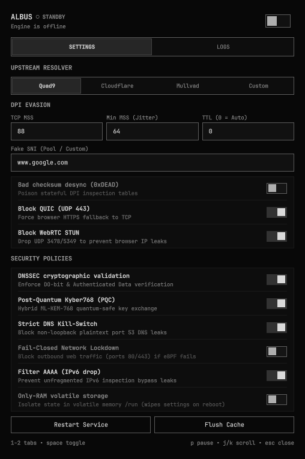
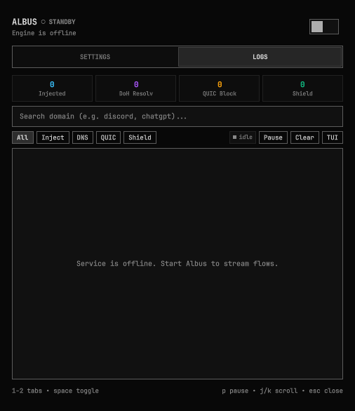

# albus

> A kernel-level deep packet inspection (DPI) evasion engine and post-quantum DNS-over-HTTPS resolver for Linux.

[](https://github.com/oqullcan)
[](https://www.rust-lang.org/)
[](https://docs.kernel.org/bpf/)
[](https://csrc.nist.gov/pubs/fips/203/final)
[](LICENSE)

---

## Abstract

**albus** implements transparent transport-layer desynchronization and post-quantum encrypted domain name resolution directly within the Linux network stack. By leveraging BPF CO-RE (`BPF_PROG_TYPE_SOCK_OPS`) attached to the unified cgroup v2 hierarchy, the engine dynamically modulates TCP Maximum Segment Size (MSS) during initial connection establishment to fragment TLS ClientHello records across multiple IP datagrams. Concurrently, a zero-allocation raw socket engine injects synthetic desynchronization payloads with destination-adaptive Time-to-Live (Auto-TTL) values, inducing state desynchronization in stateful middleboxes without disrupting end-to-end transport semantics.

---

## Technical Specifications

| Component | Standard / Mechanism | Implementation Details |
| :--- | :--- | :--- |
| **Transport Modulation** | RFC 793, eBPF `sock_ops` | `BPF_SOCK_OPS_ACTIVE_ESTABLISHED_CB` clamps MSS (88 bytes or jittered 64–88 bytes via `bpf_get_prandom_u32`); restored to line-rate (1460 bytes) via `BPF_SOCK_OPS_HDR_OPT_LEN_CB` after 600 bytes. |
| **Packet Injection** | RFC 791, RFC 8200, RFC 1071, `SOCK_RAW` | Stack-allocated dual-stack IPv4/IPv6 L3/L4 serialization with `IP_HDRINCL`/`IPV6_HDRINCL`, rotating decoy SNI pool, and optional `0xDEAD` checksum corruption. |
| **Kernel Portability** | BPF CO-RE & BTF | Ahead-of-time bytecode compilation with runtime BTF (`/sys/kernel/btf/vmlinux`) struct relocation across Linux 5.10–6.x+ kernels. |
| **Interface Roaming** | Dynamic Route Resolver | `/proc/net/route` gateway tracking seamlessly preserves state across Wi-Fi (`wlan0`), Ethernet (`eth0`), and VPN (`tailscale0`, `wg0`) transitions. |
| **Live Map Reload** | Runtime eBPF Reconfiguration | Zero-downtime updates of target ports, exclusion maps, and MSS limits via `SIGHUP` (`albus service reload` / `albus config set`). |
| **Path Heuristics** | Auto-TTL Estimation | Dynamic hop-distance probing with boundary clamping (3–12 hops) and in-memory TTL caching. |
| **Encrypted Resolver** | RFC 8484 (DoH), RFC 6891 (EDNS0), RFC 8467 | Multi-upstream HTTP/2 client pool, RFC 8467 EDNS0 Padding, DO-bit validation, Serve-Stale (RFC 8767), Dynamic TTL decay, Anti-Rebinding, and AAAA filtering. |
| **Load Balancing & Cloaking** | WP2 & EWMA Latency Probing | Weighted Power of Two multi-upstream balancing, local wildcard cloaking (0ms synthetic A/AAAA), and split-DNS forwarding. |
| **Post-Quantum Security** | NIST FIPS 203 (ML-KEM-768) | Hybrid `X25519 + Kyber768` key exchange via `aws-lc-rs` cryptographic provider. |
| **Storage & Memory** | Dual-Tier Isolation | Durable master configuration in `~/.config/albus/config.json` with volatile `/run` tmpfs runtime execution and `write_volatile` zeroization. |
| **Access Control** | Polkit Rules | Scoped `/etc/polkit-1/rules.d/albus.rules` enables passwordless desktop management for `wheel`/`sudo` users. |

---

## Architecture

```
                  ┌────────────────────────────────────────────────────────┐
                  │             Application (Browser / Client)             │
                  └───┬──────────────────────────────────────────────┬─────┘
        DNS (UDP 53,  │                                              │ TCP SYN (:443)
        TCP 53, DoH)  ▼                                              ▼
┌──────────────────────────────────────────────┐ ┌──────────────────────────────────────────────┐
│        Local High-Tier DNS Subsystem         │ │          Kernel eBPF & Packet Stack          │
├──────────────────────────────────────────────┤ ├──────────────────────────────────────────────┤
│ 1. Multi-Listener: Tuned UDP 53, RFC 7766 TCP│ │ 1. eBPF ACTIVE_ESTABLISHED                   │
│    53 (QUICKACK) & RFC 8484 Local DoH (:8053)│ │    • Clamps initial TCP MSS = 88 bytes       │
│ 2. Firefox Canary & Captive Interceptor      │ │    • Dynamic MSS Jitter ([min_mss..mss])     │
│    • use-application-dns.net (0ms NXDOMAIN)  │ │    • Notifies userspace via perf ring        │
│    • Instant probe response (No Wi-Fi lock)  │ │ 2. Raw Socket Packet Injector                │
│ 3. Local Cloaking & Split-DNS Forwarder      │ │    • Zero-allocation fake ClientHello        │
│ 4. Inotify Live Hot-Reload (Watcher)         │ │    • Decoy SNI rotation & Auto-TTL probe     │
│ 5. Domain Allowlist & HaGeZi Radix Trie      │ │    • Middlebox state desynchronization       │
│    • 200k+ rules in <5MB RAM (0ms Sinkhole)  │ │ 3. ClientHello Transmission                  │
│ 6. Wire Cache (TTL Decay & RFC 8767 Stale)   │ │    • Segmented records bypass DPI filter     │
│ 7. RFC 8467 Padding & RFC 7871 Zero-Scope ECS│ │    • Dual-stack IPv4 and IPv6 support        │
│ 8. Multi-DoH WP2 Balancer & DNS Stamps (sdns)│ │ 4. eBPF WRITE_HDR_OPT                        │
│ 9. Anti-Rebinding & Bogon/IP Blacklist Drop  │ │    • Restores native MSS (1460 bytes)        │
│10. CNAME & HTTPS/SVCB Uncloaking Defense     │ │    • Exceeds restore-after-bytes threshold   │
│11. RFC 6052 / RFC 6147 DNS64 IPv6 Synthesis  │ │ 5. Network Sentinel (netmon)                 │
│12. Audit Logger & IPcrypt Pseudonymization   │ │    • Flushes cache & resets EWMA on roaming  │
└──────────────────────────────────────────────┘ └──────────────────────────────────────────────┘
```

---

## Evasion Mechanisms

### 1. TCP Segmentation & Dynamic MSS Jitter (`--min-mss`)
Middlebox DPI systems inspect initial TCP payloads for plaintext Server Name Indication (SNI) extensions (RFC 6066). Albus programmatically sets `bpf_setsockopt(skops, SOL_TCP, TCP_BPF_MSS, mss)` on established sockets to split the ClientHello handshake across multiple TCP segments. To prevent DPI statistical fingerprinting based on static segment boundaries, Albus supports MSS Jitter: when `--min-mss` (default: `64`) is configured below `--mss` (default: `88`), the eBPF kernel hook invokes `bpf_get_prandom_u32()` to randomize the initial MSS per connection within the `[min_mss, mss]` range. After the ClientHello phase exceeds `--restore-after-bytes` (default: 600 bytes), native line-rate MSS (1460 bytes) is restored automatically.

### 2. Decoy SNI Pool Rotation & Auto-TTL Desynchronization
Albus probes the network path to estimate the router hop distance $H$ to the destination IP and computes an optimal injection TTL:
$$TTL_{opt} = \text{clamp}\left(H_{estimated} - \delta, TTL_{min}, TTL_{max}\right)$$
The zero-allocation raw socket engine synthesizes and injects a fake ClientHello matching the socket 4-tuple. To defeat middlebox heuristics that filter static fake payloads, Albus rotates across a pre-compiled pool of high-reputation decoy SNIs (Google, Cloudflare, Microsoft, AWS, Apple) unless a specific `--fake-sni` override is provided. The fake segment expires at or just past the DPI middlebox, poisoning its state table, while the authentic segmented payload reaches the destination intact.

### 3. Dual-Stack IPv6 & IPv4 eBPF Evasion
The eBPF kernel program (`sockops.bpf.c`) natively processes both `AF_INET` and `AF_INET6` socket families. For IPv6 connections, it extracts 128-bit IPv6 endpoints (`remote_ip6` / `local_ip6`), checks the dedicated `exclude_ips_v6` 16-byte BPF hash map, modulates MSS, and emits 128-bit connection events. The userspace injector synthesizes valid RFC 8200 IPv6 raw packets with full TCP pseudo-header checksum computation transmitted via `IPV6_HDRINCL`.

### 4. Zero-Downtime Live Map Reload (SIGHUP)
Runtime configurations—including target ports, exclusion IP lists, and MSS bounds—can be updated instantly without restarting `albus.service` or severing active network connections. Dispatching `SIGHUP` (or executing `sudo albus service reload` / `albus config set ...`) synchronizes running eBPF maps atomically in kernel space.

### 5. Post-Quantum DoH Resolution
To mitigate "Harvest Now, Decrypt Later" surveillance, the DNS subsystem employs hybrid post-quantum key encapsulation (`X25519Kyber768Draft00` / `SecP256r1MLKEM768`). Upstream queries to Quad9, Cloudflare, and Mullvad are protected against future cryptanalytic attacks on elliptic-curve discrete logarithms.

### 6. DNS Leak Protection & Active Canary Watchdog
- **DNS Kill-Switch (`--kill-switch`)**: Injects kernel-level firewall (`iptables`/`ip6tables`) drop rules on all outbound non-loopback UDP/TCP port 53 traffic. Ensures no misconfigured background processes can leak plaintext DNS queries to the local ISP.
- **Active Leak Canary Watchdog**: An autonomous background prober actively queries `leak-test.albus.internal` every 60 seconds over loopback (`127.0.0.1:53`), verifying the synthetic canary record (`127.0.0.99`). If queries fail or return unexpected data (due to VPN route takeovers, network managers overwriting `/etc/resolv.conf`, or DNS hijacking), it triggers instant autonomous self-healing.
- **Fail-Closed Network Lockdown (`--network-lockdown`)**: Distinct from the DNS Kill-Switch, Network Lockdown drops all outbound non-loopback web traffic (TCP 80 and 443) if the eBPF subsystem fails to attach. This guarantees that unfragmented, unevaded cleartext traffic is never leaked to the ISP if DPI evasion cannot be sustained.
- **WebRTC STUN Blocking (`--block-stun`)**: Drops outbound UDP traffic on standard STUN/TURN ports 3478 and 5349 to eliminate real IPv4/IPv6 exposure through WebRTC peer connection candidates.

### 7. Enterprise-Grade Hardened DNS Subsystem
- **CNAME & HTTPS/SVCB AliasMode Uncloaking Defense**: Inspects resolved CNAME chains and RFC 9460 HTTPS/SVCB AliasMode targets against the Radix Trie blocklist, preventing tracking vendors from evading blocklists through first-party subdomain disguises.
- **Zero-Allocation Domain Allowlist Engine**: Fast exact and wildcard exception engine (`--allow-domains`, `--allowlist-path`) enabling instant false-positive bypass without disabling global threat blocklists.
- **RFC 8467 EDNS(0) Discrete Padding & RFC 7871 ECS Zero-Scope**: Disguises encrypted DoH payload lengths by padding requests to standardized discrete boundaries (`64, 128, 192, 256, 320, 384, 512, 704, 768, 896, 960, 1024, 1088, 1152, 2688, 4080`), neutralizing side-channel DPI packet size fingerprinting, while appending ECS `source_prefix = 0` to explicitly forbid upstream resolvers from forwarding client subnet info.
- **Ultra-Compact HaGeZi Blocklist Engine**: High-performance arena-based label-reversed suffix radix trie storing 200,000+ domain rules (HaGeZi Multi PRO + TIF) in < 5 MB of RAM. Features automatic subdomain pruning, sub-millisecond pre-compiled binary cache loading (`blocklist.bin`), and 0ms sinkholing (`0.0.0.0` / `::`).
- **Response IP & Bogon Filtering (`--block-bogons`)**: Analyzes resolved A/AAAA addresses and drops responses resolving to bogon ranges (RFC 5735 / RFC 6890) or custom malicious IP subnets, thwarting DGAs and bulletproof hosters.
- **Linux Network Change Sentinel (`netmon`)**: Autonomous background sentinel monitoring interface and routing transitions (Wi-Fi SSID changes, VPN connect/disconnect), automatically purging stale DNS caches and resetting upstream EWMA performance scores.
- **Kernel Socket Flag Tuning**: Configures socket layer with `IP_FREEBIND` (eliminating boot-time startup race conditions), `IP_TOS 0x70` (interactive low-latency DSCP classification), and 256KB socket buffers.
- **RFC 7766 Local TCP Port 53 Listener**: Length-prefixed framing and `TCP_QUICKACK` support for large DNSSEC payloads, zone transfers, and stub resolvers (`systemd-resolved`, `dig +tcp`).
- **RFC 8484 Local DoH Server (`local-doh`)**: High-performance HTTP/1.1 endpoint on `127.0.0.1:8053/dns-query` accepting POST (`application/dns-message`) and GET (`?dns=<base64url>`), eliminating the need to modify `/etc/resolv.conf` for modern browsers.
- **DNS Stamp Parser (`sdns://`)**: Native decoder for standardized DNS Stamps (DoH, ODoH), resolving upstream URLs, ports, bootstrap IPs, and cryptographic attributes.
- **Structured Threat & Query Audit Logger (IPcrypt)**: Non-blocking asynchronous rotating query logger (TSV) with 32-bit format-preserving Feistel cipher (`IPcrypt`) to pseudonymize client IPv4/IPv6 addresses while preserving grouping semantics.
- **Zero-Downtime Rule Hot-Reload (`FileWatcher`)**: Inotify-based file watcher monitoring allowlist and blocklist paths, automatically hot-reloading rules into the active resolver without daemon interruption.
- **RFC 6052 / RFC 6147 DNS64 IPv6 Synthesis**: Automatically synthesizes standard `64:ff9b::/96` IPv6 AAAA answers for IPv4-only domains in NAT64 environments.
- **Firefox DoH Canary Interception**: Intercepts `use-application-dns.net`, forcing Mozilla Firefox to disable internal bypass DoH and route 100% of DNS traffic through Albus.
- **Captive Portal Detection**: Synthesizes instant probe responses for Apple, Android, Windows, and Linux connectivity probes, preventing Wi-Fi captive portal lockouts in airports, hotels, and public venues.
- **Undelegated & Unqualified Domain Blocking**: Automatically filters dotless names, `.local`, `.lan`, `.home`, `.internal`, `.corp`, and private reverse lookup zones (`in-addr.arpa`, `ip6.arpa`), returning immediate 0ms `NXDOMAIN` to prevent private topology exposure upstream.
- **Advanced Dynamic Cache & Serve-Stale (RFC 8767)**: Real-time dynamic TTL decay accurately decrements remaining TTL. Implements RFC 2308 negative caching (60s), min/max TTL clamping (60s–86400s), and fallback to expired stale cache records during upstream outages or network instability.
- **Anti-DNS-Rebinding Protection**: Validates responses from public upstream resolvers. If a public domain resolves to RFC 1918 private, loopback, or link-local subnets, the response is dropped with `REFUSED` to protect internal services and IoT devices from rebinding attacks.
- **Weighted Power of Two (WP2) Load Balancing**: Tracks exponential moving average (EWMA) latency and error rates across multi-upstreams. Evaluates pairs of upstream candidates and routes queries to the optimal resolver, eliminating herd behavior.
- **Local Cloaking & Split-DNS Forwarding**: Directs exact and wildcard hosts (`*.home`, `app.local`) to local synthetic IPs without altering `/etc/hosts`, and dispatches dedicated internal zones directly to company DNS forwarders over UDP.
- **Live Threat Telemetry & TUI Integration**: Publishes atomic metric snapshots to volatile tmpfs (`/run/albus/stats.json`), rendering real-time query counts, cache hit ratios, and blocked tracker telemetry in `albus monitor`.

---

## Installation & Build

### Prerequisites
- **Kernel**: Linux 5.10+ with `CONFIG_BPF=y`, `CONFIG_BPF_SYSCALL=y`, and cgroup v2.
- **Toolchain**: Rust 1.75+ (Cargo). *(Pre-built binary runs standalone via BPF CO-RE without clang or kernel headers).*
- **Permissions**: `CAP_NET_RAW`, `CAP_BPF`, `CAP_NET_ADMIN` (or `sudo`).

### Compilation
```bash
git clone https://github.com/oqullcan/albus.git
cd albus
git checkout v2.1.0

# Compile release profile with LTO and binary stripping
cargo build --release

# Install binary to system path
sudo cp target/release/albus /usr/local/bin/albus
```

---

## Command-Line Interface

### Core Execution
```bash
# Start engine with default parameters
sudo albus run

# Enforce volatile Only-RAM execution in /run tmpfs
sudo albus run --ram-only=true --pqc=true

# Configure Mullvad upstream with malware and tracker blocking
sudo albus run --doh-upstream mullvad-base

# Custom DoH endpoint with dedicated bootstrap IP addressing or DNS Stamp
sudo albus run --doh-upstream "sdns://AgMAAAAAAAAABzkuOS45LjkADWRucy5xdWFkOS5uZXQKL2Rucy1xdWVyeQ"

# Enable structured query logger with IPcrypt pseudonymization
sudo albus run --query-log=true --query-log-path=/var/log/albus/query.log --ipcrypt-key=0123456789abcdef0123456789abcdef
```

### Daemon & Configuration Management
```bash
sudo albus service install   # Install systemd unit and provision albus.rules
sudo albus service start     # Start background daemon
sudo albus service status    # Inspect operational metrics
sudo albus service reload    # Send SIGHUP for zero-downtime runtime map reload
albus config get             # Inspect active persistent configuration (JSON)
sudo albus config set --doh-upstream cloudflare  # Update settings and reload daemon live
albus monitor                # Interactive curses-style telemetry TUI
sudo albus cleanup           # Restore original /etc/resolv.conf and purge firewall rules
```

### Options Reference
| Flag | Type | Default | Description |
| :--- | :--- | :--- | :--- |
| `--mss` | `u16` | `88` | Initial TCP MSS size for TLS ClientHello fragmentation |
| `--min-mss` | `u16` | `64` | Minimum TCP MSS for randomized per-connection jitter (`0` disables jitter) |
| `--restore-after-bytes` | `u32` | `600` | Transmitted byte threshold prior to line-rate MSS restoration |
| `--ports` | `Vec<u16>` | `[443]` | Target destination ports for eBPF sock_ops interception |
| `--fake-ttl` | `u8` | `8` | Fallback TTL for raw socket packet injection |
| `--auto-ttl` | `bool` | `true` | Dynamic hop-distance path measurement |
| `--fake-sni` | `String` | `None` | Server Name Indication override (defaults to rotating high-reputation pool) |
| `--fake-bad-checksum` | `bool` | `false` | Invalidate TCP checksum (`0xDEAD`) for middlebox corruption |
| `--doh` | `bool` | `true` | Spawn local DNS-over-HTTPS resolver on `127.0.0.1:53` |
| `--doh-upstream` | `String` | `"quad9"` | Upstream resolver (`quad9`, `cloudflare`, `mullvad-*`, `sdns://...`, URL) |
| `--doh-bootstrap-ips` | `Vec<IPv4>`| `[]` | Static IPv4 bootstrap endpoints for DoH host resolution |
| `--tcp-listener` | `bool` | `true` | Local TCP port 53 listener with RFC 7766 length-prefixed framing |
| `--local-doh` | `bool` | `true` | Local DoH HTTP/1.1 endpoint (RFC 8484) on `127.0.0.1:8053/dns-query` |
| `--local-doh-addr` | `String` | `"127.0.0.1:8053"` | Local DoH server bind address |
| `--query-log` | `bool` | `false` | Structured query and threat audit logger |
| `--query-log-path` | `String` | `None` | File path for rotating query log output |
| `--ipcrypt-key` | `String` | `None` | 128-bit hex key for client IP pseudonymization (IPcrypt) |
| `--dnssec` | `bool` | `true` | Enforce EDNS0 DO-bit and Authenticated Data validation |
| `--pqc` | `bool` | `true` | Enable hybrid ML-KEM-768 post-quantum key exchange |
| `--ram-only` | `bool` | `false` | Isolate runtime state in volatile `/run` tmpfs while retaining preferences |
| `--block-quic` | `bool` | `true` | Drop outbound UDP 443 to force TLS/TCP transport |
| `--block-stun` | `bool` | `true` | Drop outbound STUN (UDP 3478, 5349) to prevent WebRTC IP leaks |
| `--kill-switch` | `bool` | `true` | Strict DNS kill-switch dropping non-loopback UDP/TCP 53 |
| `--network-lockdown` | `bool` | `false` | Fail-closed network kill-switch dropping TCP 80/443 if eBPF fails |
| `--block-ipv6` | `bool` | `true` | Filter AAAA queries to prevent IPv6 inspection bypass leaks |
| `--anti-dns-rebinding` | `bool` | `true` | Drop upstream responses resolving to private/loopback IPs |
| `--block-undelegated` | `bool` | `true` | Block queries for dotless names, `.local`, `.lan`, and private zones |
| `--edns-padding` | `bool` | `true` | Pad encrypted DoH queries to discrete block boundaries (RFC 8467) |
| `--blocklist` | `bool` | `true` | Enable compact in-memory HaGeZi Multi PRO + TIF ad/malware filter |
| `--blocklist-path` | `String` | `None` | Path to custom domain blocklist file or compiled binary |
| `--allow-domains` | `Vec<String>` | `[]` | Comma-separated list of domains to whitelist / bypass blocklists |
| `--allowlist-path` | `String` | `None` | Path to custom plain-text domain whitelist file |
| `--uncloak-cnames` | `bool` | `true` | Uncloak CNAME & HTTPS/SVCB alias chains against blocklist |
| `--block-bogons` | `bool` | `true` | Drop upstream responses resolving to bogon / reserved IP subnets |
| `--dns64` | `bool` | `false` | Synthesize RFC 6052 `64:ff9b::/96` IPv6 addresses for IPv4-only domains |
| `--netmon` | `bool` | `true` | Monitor network changes and flush DNS cache / reset EWMA scores on roaming |

---

## Desktop Integration (Omarchy Shell)

Albus includes a first-party Omarchy Quattro desktop panel widget (`BarWidget.qml` & `Panel.qml`) providing live packet stream monitoring, one-click resolver switching (Quad9, Cloudflare, Mullvad profiles), security toggles, and keyboard shortcuts (`1-2` tabs, `Space` toggle, `P` pause, `J/K` scroll).

<p align="center">
  
  
</p>

```bash
# Deploy plugin to active user configuration directory
mkdir -p ~/.config/omarchy/plugins/io.github.oqullcan.albus.dev
cp manifest.json BarWidget.qml Panel.qml ~/.config/omarchy/plugins/io.github.oqullcan.albus.dev/
omarchy-shell shell rescanPlugins
```

---

## License

This project is licensed under the [GNU General Public License v3.0 (GPL-3.0)](LICENSE).
